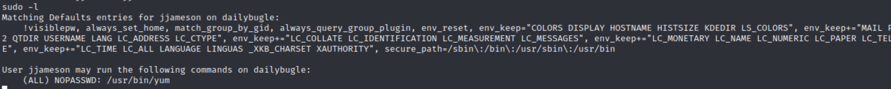

# The Daily Bugle

A writeup on the tryhackme challenge.


### nmap
To start, I ran nmap to show what ports are open on the machine.


The nmap scan shows some interesting directories on the web server.


### website


I then check `robots.txt`.


All of these pages are blank pages except for `/administrator/`.


I tried the default credentials `admin:admin`, but with no success.


Now I know that the website is running Joomla.

### joomla exploit

I am able to discover the version thanks to [hacker tricks](https://book.hacktricks.xyz/network-services-pentesting/pentesting-web/joomla)


Clearly this is Joomla 3.7.0

I tried a number of different exploits using `sqlmap` but they didn't work.


Finally I had success using [this exploit from github](https://github.com/stefanlucas/Exploit-Joomla).


Now this hash is taken to [this site](https://hashes.com/en/tools/hash_identifier).


It also cracks the hash as well as identifying it, which is convenient. 

We can log into the admin panel with `jonah:spiderman123`. Unfortunately this doesn't let us sign in to ssh.


### getting into the system

I looked up "how to spawn a shell in joomla" on google and found [this](https://www.hackingarticles.in/joomla-reverse-shell/).


I generate a [php reverse shell](https://www.revshells.com/), and start a `nc` session to listen for the shell when it is called.


Then to activate the shell, I clicked "Template Preview". This step wasn't actually clarified in the article.


Now I check back with my `nc` session and see we are in.


### escalation

I spent a while aimlessly looking for escalation vectors, but didn't find anything until I poked around the website information.


`cat configuration.php`

```
<?php
class JConfig {
        public $offline = '0';
        public $offline_message = 'This site is down for maintenance.<br />Please check back again soon.';
        public $display_offline_message = '1';
        public $offline_image = '';
        public $sitename = 'The Daily Bugle';
        public $editor = 'tinymce';
        public $captcha = '0';
        public $list_limit = '20';
        public $access = '1';
        public $debug = '0';
        public $debug_lang = '0';
        public $dbtype = 'mysqli';
        public $host = 'localhost';
        public $user = 'root';
        public $password = 'nv5uz9r3ZEDzVjNu';
        public $db = 'joomla';
        public $dbprefix = 'fb9j5_';
        public $live_site = '';
        public $secret = 'UAMBRWzHO3oFPmVC';
        public $gzip = '0';
        public $error_reporting = 'default';
        public $helpurl = 'https://help.joomla.org/proxy/index.php?keyref=Help{major}{minor}:{keyref}';
        public $ftp_host = '127.0.0.1';
        public $ftp_port = '21';
        public $ftp_user = '';
        public $ftp_pass = '';
        public $ftp_root = '';
        public $ftp_enable = '0';
        public $offset = 'UTC';
        public $mailonline = '1';
        public $mailer = 'mail';
        public $mailfrom = 'jonah@tryhackme.com';
        public $fromname = 'The Daily Bugle';
        public $sendmail = '/usr/sbin/sendmail';
        public $smtpauth = '0';
        public $smtpuser = '';
        public $smtppass = '';
        public $smtphost = 'localhost';
        public $smtpsecure = 'none';
        public $smtpport = '25';
        public $caching = '0';
        public $cache_handler = 'file';
        public $cachetime = '15';
        public $cache_platformprefix = '0';
        public $MetaDesc = 'New York City tabloid newspaper';
        public $MetaKeys = '';
        public $MetaTitle = '1';
        public $MetaAuthor = '1';
        public $MetaVersion = '0';
        public $robots = '';
        public $sef = '1';
        public $sef_rewrite = '0';
        public $sef_suffix = '0';
        public $unicodeslugs = '0';
        public $feed_limit = '10';
        public $feed_email = 'none';
        public $log_path = '/var/www/html/administrator/logs';
        public $tmp_path = '/var/www/html/tmp';
        public $lifetime = '15';
        public $session_handler = 'database';
        public $shared_session = '0';
}
```
This contains a password, which I used to gain access to the account `jjameson`.


Then I found that jjameson could run `yum` as root.



Running [this code from gtfobins](https://gtfobins.github.io/gtfobins/yum/#sudo) I gain root access!

